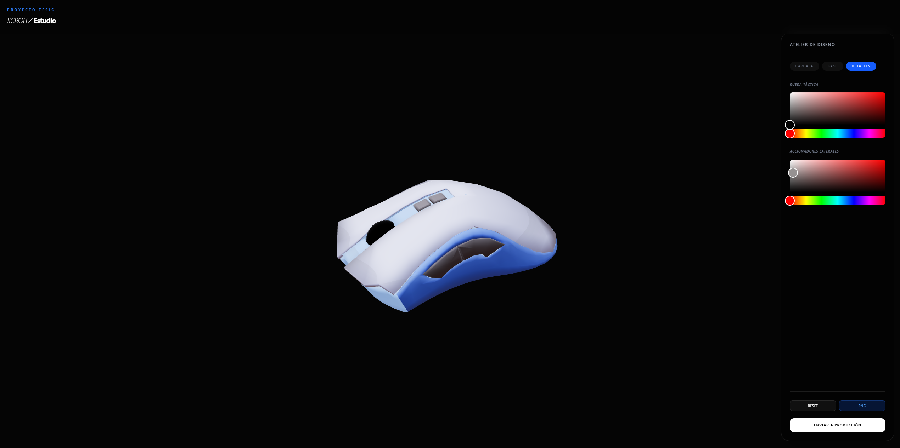

# 🖱️ ScrollZ Studio | 3D Configurator



## 🚀 Sobre el Proyecto
Este configurador inmersivo permite a los usuarios personalizar periféricos de alta gama en un entorno 3D tiempo real. 
Desarrollado como prototipo de tesis para la fusión de **Ingeniería de Software** y **Diseño**.

### ✨ Características Principales
* **Renderizado PBR Premium:** Acabados mate satinados optimizados para WebGL.
* **Interfaz Glassmorphism:** UI moderna inspirada en los estándares estéticos de Apple.
* **Exportación de Diseño:** Captura instantánea del Canvas en formato .PNG para cotizaciones.
* **Control Cinematográfico:** Sistema de cámara suave con amortiguación (Damping).

## 🛠️ Stack Tecnológico
* **React 18** + **TypeScript**
* **Three.js** (vía React Three Fiber & Drei)
* **Zustand** (Manejo de estado global)
* **Tailwind CSS** (Estilizado de UI)

## 📦 Instalación
```bash
# Clonar el repositorio
git clone [https://github.com/talenzt/mouse-custom.git](https://github.com/talenzt/mouse-custom.git)

# Entrar a la carpeta
cd mouse-custom

# Instalar dependencias
npm install

# Iniciar servidor de desarrollo
npm run dev